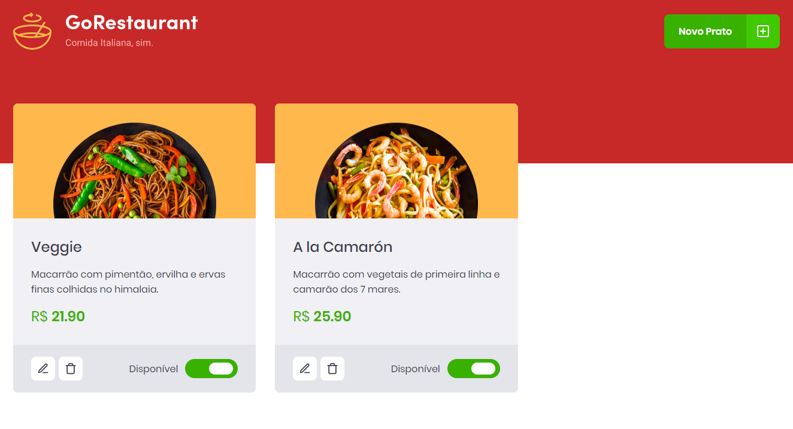

# GoRestaurant
<p>O GoRestaurant é uma aplicação fictícia em <strong>React.js</strong> que se trata de um painel de admin para restaurantes
controlarem quais refeições estão disponíveis e quais estão indisponíveis.</p>

<p>Desenvolvida no <a href="https://github.com/Rocketseat/bootcamp-gostack-desafios/tree/master/desafio-reactjs-crud">Desafio 10</a> do Bootcamp GoStack da Rocketseat.</p>

## Preview 
<p align="center">
  
</p>

## Tecnologias Utilizadas 🚀
React ⚛️ <br />
React Modal ⚛️ <br />
Styled-Components 💅🏻 <br />
Jest 🃏 <br />
React Icons ⚛️❤️ <br />
Typescript 🦕

## :books: Guia de instalação e execução

### Pré-requisitos

- [Git](https://git-scm.com/)
- [Node.js](https://nodejs.org/en/) v10.20 ou maior
- [Yarn](https://yarnpkg.com/)

### Como executar

- Clone este repositório ```git clone https://github.com/MayconRRibeiro/gostack-reactjs-crud.git```
- Vá até o diretório ```cd gostack-reactjs-crud```
- Execute ```yarn``` para instalar as dependências
- Execute ```yarn start``` para rodar a aplicação
- Em outro terminal, execute ```yarn json-server server.json -p 3333``` para executar a simulação de uma API

⚠️ Caso o projeto não mostre os produtos, rode <code>adb reverse tcp:3333 tcp:3333</code> antes de iniciar a Fake API ⚠️

Pronto! Você pode visualizar o GoRestaurant através do endereço http://localhost:3000

### Testes

- Para executar os testes rode ```yarn test```

## Como Contribuir? 😍
**Faça um fork deste repositório**

```bash
# Clone o seu fork
$ git clone url-do-seu-fork && cd nome-do-projeto

# Crie uma branch com sua feature ou correção de bugs
$ git checkout -b minha-branch

# Faça o commit das suas alterações
$ git commit -m 'minhas alterações'

# Faça o push para a sua branch
$ git push origin minha-branch
```

Delete sua branch, se quiser, quando o merge da sua pull request for feito. <br />

Feito com 💜 por Maycon Renan Ribeiro dos Santos
